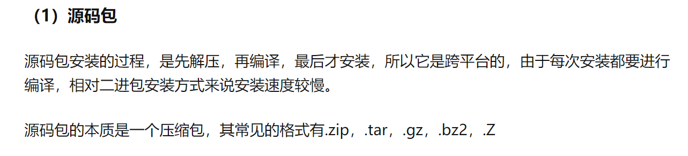
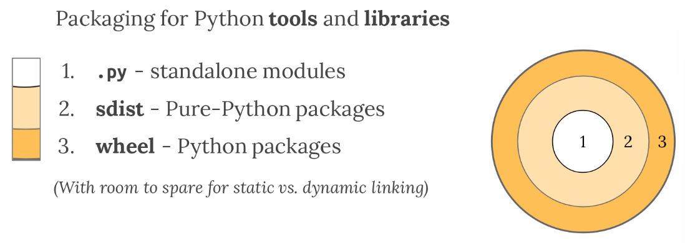
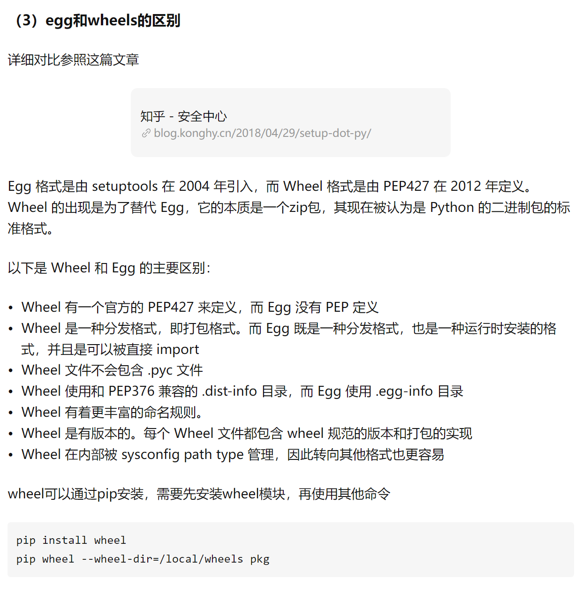
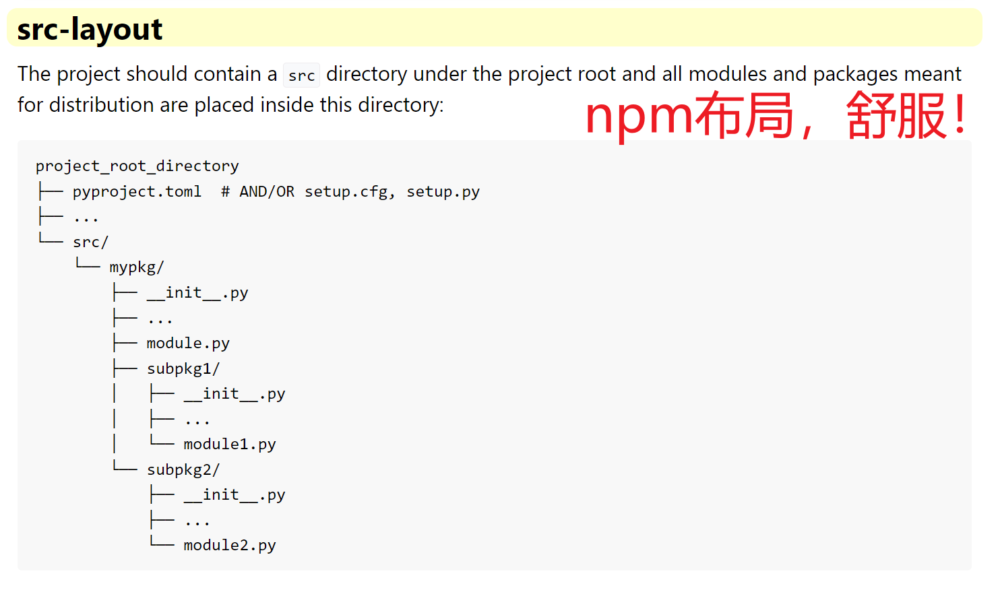
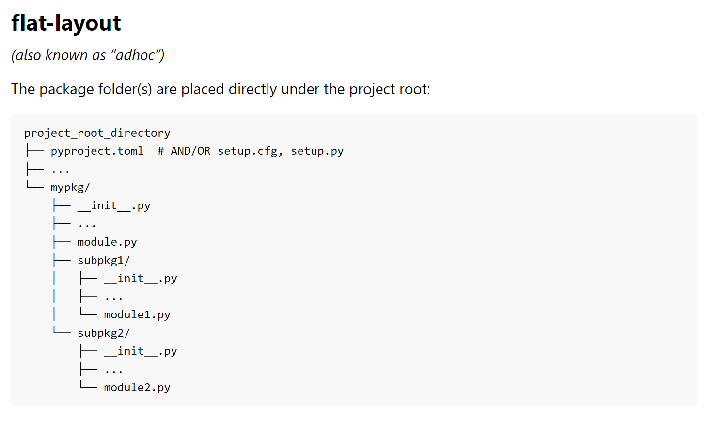
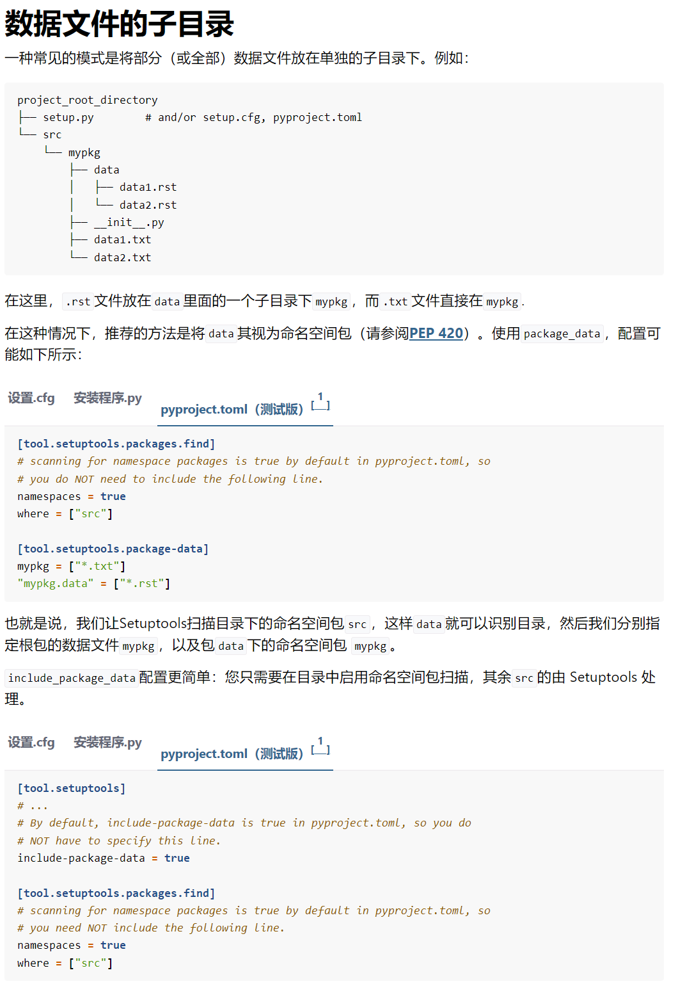
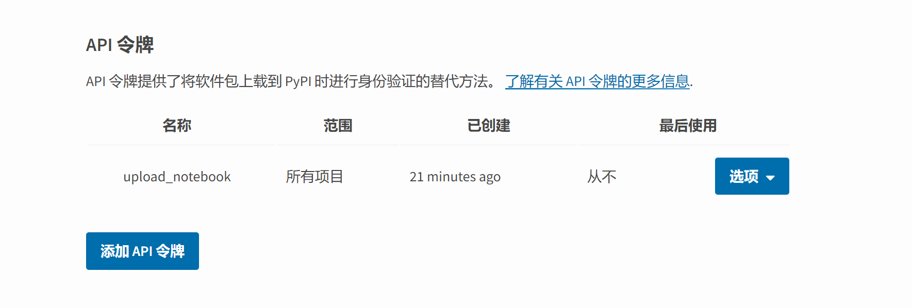
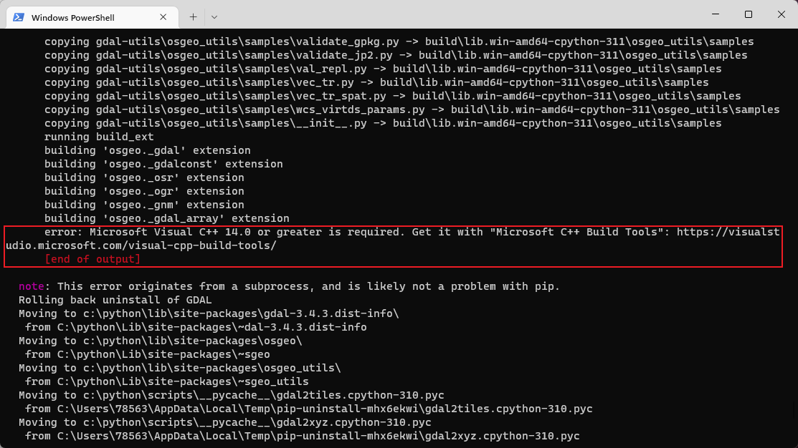
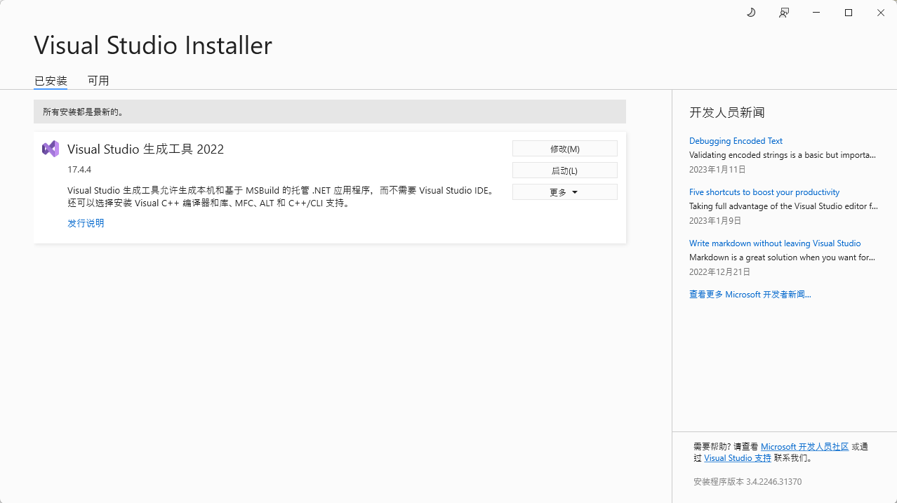

# python包的构建和分发

官网地址：https://setuptools.pypa.io/en/latest/userguide/index.html

早期pkg管理工具easy_install，现在已经被pip取代。

其他细节：https://packaging.python.org/en/latest/key_projects/

早期的包构建和分发工具**distutils**，将在python3.12之后被移除，彻底采用**setuptools**

distutils：https://docs.python.org/zh-cn/3/library/distutils.html

```
打包工具推荐
1.使用setuptools定义项目。
2.使用build创建Source Distributions和wheel。如果您有二进制扩展并希望为多个平台分发轮子，请使用cibuildwheel作为 CI 设置的一部分来构建可分发轮子。
3.使用twine将分布上传到PyPI。（需要先pypi创建账号）
```

**源码包**



**二进制包**

.gg包已经过时。





## 目前主流构建方式

默认环境

```
# build是python的命令行工具，可以通过它来快捷构建project
$ pip install --upgrade build wheel setuptools setuptools-scm
```

推荐的构筑方式

```
# wheel 二进制格式
$ python3 -m build --wheel source-tree-directory
# sdist 源码格式
$ python3 -m build --sdist source-tree-directory
```

```
# 命令行工具
$ python -m build -h
```

### 配置文件的三种形式

```
# 使用setuptools时，需要的包配置文件。任选一种or三种自由组合。。。
pyproject.toml
setup.cfg
setup.py

# 这里我们选择官方推荐的.toml格式的配置文件（python 内置了）
```

### 目录结构

结构1

```
mypackage
├── pyproject.toml  # and/or setup.cfg/setup.py (depending on the configuration method)
├── # README.rst or README.md (a nice description of your package)
├── # LICENCE (properly chosen license information, e.g. MIT, BSD-3, GPL-3, MPL-2, etc...)
└── mypackage1
|   ├── __init__.py
|   └── ... (other Python files)
└── mypackage2
    ├── __init__.py
    └── ... (other Python files)
.....
```

**结构2**本人强烈推荐这种布局



结构3



### 配置文件参数

元数据字段：https://packaging.python.org/en/latest/specifications/declaring-project-metadata/

```
# 官方推荐使用pyproject.toml在项目根目录中，一口气配置全部参数

# 系统构建
[build-system]
# 使用插件
requires = ["setuptools", "setuptools-scm"]
# requires = ["setuptools"]
build-backend = "setuptools.build_meta"

# 配置工具
[tool.setuptools]
# 自动添加数据文件
include-package-data = true

# 配置插件
[tool.setuptools_scm]
# 设置版本自动更新
write_to = "src/_version.py"
# 默认版本模板
write_to_template= '__version__ = "{version}"'
# 版本风格
version_scheme = "guess-next-dev"
local_scheme = "no-local-version"

# 项目基础信息https://packaging.python.org/en/latest/specifications/declaring-project-metadata/
[project]
# 项目名称
name = "LeroykTest"
# 版本，由于使用了setuptools_scm可以自动更新版本，如果配置，则会报错
# version = "1.0.0"

# 项目描述
description = "用来测试python打包"
# 完整自述文件readme.md or README.rst
readme = "readme.md"
# python版本要求
requires-python = ">=3.6"
# 作者信息
authors = [
  {email = "bridieiybnf@gmail.com"},
  {name = "LeroyK"}
]
# 维护人员
# maintainers = [
  {name = "Brett Cannon", email = "brett@python.org"}
]


# 遵守协议
license = {text = "MIT License"}
# 分类器https://pypi.org/classifiers/根据需求填写
classifiers = [
    "Programming Language :: Python :: 3",
    "Development Status :: 4 - Beta"
]
# 忽略字段,会被彻底忽略，官方推荐安装setuptools_scm，则会忽略version这个字段
dynamic = ["version"]
# 关键字段,会被pypi展示
keywords = ["name", "authors", "urls"]
# 官方地址
urls = {Project-URL="https://github.com/LeroyK111/python_packing_notes"}

# 必须依赖
dependencies = [
    "requests",
    'importlib-metadata; python_version>"3.6"',
    "PySimpleGUI"
]

# 可选依赖
[project.optional-dependencies]
pdf = ["ReportLab>=1.2", "RXP"]
rest = ["docutils>=0.3", "pack==1.1, ==1.3"]

# 更多网址
# [project.urls]
# homepage = "https://example.com"
# documentation = "https://readthedocs.org"
# repository = "https://github.com"
# changelog = "https://github.com/me/spam/blob/master/CHANGELOG.md"


# python脚本，可以直接在shell中执行LeroykTest从而调用func
# 写在__init__中的对象，不需要在加点LeroykTest.__init__
# https://setuptools.pypa.io/en/latest/userguide/entry_point.html
[project.scripts]
LeroykTest = "function"

# PySimpleGUI专用
[project.gui-scripts]
spam-gui = "spam:main_gui"

# 插件语法：https://setuptools.pypa.io/en/latest/userguide/entry_point.html
# [project.entry-points."spam.magical"]
# tomatoes = "spam:main_tomatoes"
```

简单目录结构，可以自己检查所有package。但是总有意外。。。算法并不是无敌的。

#### 高级包管理tool.setuptools.packages

一般都是自动发现包，前提是目录结构不会太夸张.

https://setuptools.pypa.io/en/latest/userguide/package_discovery.html

```
# 方法一，手动包发现
[tool.setuptools]
packages = ["mypkg", "mypkg.subpkg1", "mypkg.subpkg2"]
package-dir = {"" = "src"}

[tool.setuptools.package-dir]
mypkg = "lib"
"mypkg.subpkg1" = "lib1"


# 方法二，列表配置，一项项来
[tool.setuptools.packages.find]
where = ["src"]  # ["."] by default
include = ["mypackage*"]  # ["*"] by default
exclude = ["mypackage.tests*"]  # empty by default
namespaces = false  # true by default


# 方法三，字典配置包所在目录
[tool.setuptools.packages]
find = {}  # Scanning implicit namespaces is active by default
# OR
find = {namespaces = false}  # Disable implicit namespaces
```

#### 系统构建build-system

setuptools-scm：https://github.com/pypa/setuptools_scm/

```
[build-system]
requires = ["setuptools", "setuptools-scm"]
build-backend = "setuptools.build_meta"
```

#### 入口点project.scripts

https://setuptools.pypa.io/en/latest/userguide/entry_point.html

```
除了对pkg中加入__main__.py，然后使用python -m pkg外。
可以设置脚本script, 直接将命令放入shell中。可以全局调用。
[project.scripts]
my-script = "LeroykTest.module:function"
```

#### 依赖管理

https://setuptools.pypa.io/en/latest/userguide/dependency_management.html

```
[project]
# 必须依赖
dependencies = [
    "docutils",
    "BazSpam == 1.1",
    "enum34; python_version<'3.4'",
    "enum34; python_version<'3.4'",
    "pywin32 >= 1.0; platform_system=='Windows'",
    "Package-A @ git+https://example.net/package-a.git@main",
]
# 可选依赖
[project.optional-dependencies]
PDF = ["ReportLab>=1.2", "RXP"]
```

#### 数据文件支持

https://setuptools.pypa.io/en/latest/userguide/datafiles.html

就是打包的适合，可以放入其他非.py的文件进入，比如html，css，js等等。。。

```
[tool.setuptools]
# 开启数据打包即可
include-package-data = true

[tool.setuptools.package-data]
# 筛选器
mypkg = ["*.txt", "*.rst"]
# 高级筛选器
"*" = ["*.txt"]
mypkg1 = ["data1.rst"]


[tool.setuptools.exclude-package-data]
# 排除包
mypkg = [".gitattributes"]
```



#### 构建扩展模块(了解cpython)

https://setuptools.pypa.io/en/latest/userguide/ext_modules.html

Setuptools 可以构建 C/C++ 扩展模块。比如pandas numpy等.

通过插件，也可以构建golang。

```
pip install Cython
```

#### 开发模式（了解）

https://setuptools.pypa.io/en/latest/userguide/development_mode.html

```
pip install --editable .
```

### 开始build

官网地址：https://pypa-build.readthedocs.io/en/latest/

有坑：

**由于我们使用了setuptools_scm插件，则会自动更新project的version版本号，但是大多数情况，我们还是想要自定义版本号, 那我们就需要停用setuptools_scm插件。**

```
# 如果报错，请查看log
$ python -m build

# 默认会生成root/dist文件夹，默认构筑两种形式。
project
|--dist
|	|
|	|--LeroykTest-0.1.dev2-py3-none-any.whl
|	|--LeroykTest-0.1.dev2.tar.gz
|	
|--src
	|
	|--module1
	|--module2
	|--__init__.py
	|--_version.py
	|...
	

# 其他命令（只构筑源码or只构筑轮子）
python -m build -h
usage: python -m build [-h] [--version] [--sdist] [--wheel] [--outdir OUTDIR] [--skip-dependency-check] [--no-isolation] [--config-setting CONFIG_SETTING] [srcdir]

    A simple, correct PEP 517 build frontend.

                        output directory (defaults to {srcdir}\dist)
  --skip-dependency-check, -x
                        do not check that build dependencies are installed
  --no-isolation, -n    do not isolate the build in a virtual environment
  --config-setting CONFIG_SETTING, -C CONFIG_SETTING
                        pass options to the backend.  options which begin with a hyphen must be in the form of "--config-setting=--opt(=value)" or "-C--opt(=value)"
```

## **twine分发**

官网https://twine.readthedocs.io/en/latest/

```
安装上传工具
$ pip install twine
```

### 注册pypi账号

https://pypi.org/manage/account/



推荐生成token API密钥，**配置$HOME/.pypirc**文件进行上传包。

### 常用命令

推荐使用token配置文件，进行无登录的上传package。

$HOME/.pypirc

https://packaging.python.org/en/latest/specifications/pypirc/

```
# Twine 将提示您输入用户名和密码。（这里是即时login in）
# 也可以使用.pypirc进行无登录上传文件。

# 不推荐上传到测试库，经常失联！！！
$ twine upload -r testpypi dist/*

# 上传到PyPI：
$ twine upload dist/*

# 检查发行库（用来判断pypi和本地dist/*的一致性）
$ twine check -h
$ twine check dist/*

# 注册（只适合提供注册服务的服务器，官方还是推荐PyPI token上传）
$ twine register -h
```

```
# file: $HOME/.pypirc 用户目录下

# 启用服务器
[distutils]
index-servers =
    pypi
    testpypi
    private-repository

# 正式上传服务器
[pypi]
username = __token__
password = <PyPI token>

# 测试上传服务器
[testpypi]
repository = https://test.pypi.org/legacy/
username = <your TestPyPI username>
password = <your TestPyPI password>

# 其他上传服务器
[private-repository]
repository = <private-repository URL>
username = <private-repository username>
password = <private-repository password>
```

## 其他

### 可执行文件

- [pyInstaller](https://pyinstaller.readthedocs.io/en/stable/) - 跨平台
- [cx_Freeze](https://marcelotduarte.github.io/cx_Freeze/) - 跨平台
- [构造函数](https://github.com/conda/constructor)- 用于命令行安装程序
- [py2exe](http://www.py2exe.org/) - 仅限 Windows
- [py2app](https://py2app.readthedocs.io/en/latest/) - 仅限 Mac
- [osnap](https://github.com/jamesabel/osnap) - Windows 和 Mac
- [pynsist](https://pypi.org/project/pynsist/) - 仅限 Windows

## 常见构筑错误

### C++扩展构筑异常

[解决方案](https://stackoverflow.com/questions/64261546/how-to-solve-error-microsoft-visual-c-14-0-or-greater-is-required-when-inst)



直接下载对应构筑的工具，然后安装即可。



### 重坑

<a href='https://tseing.github.io/sui-sui-nian/2022-08-11-prettymaps-install.html'>GDAL存在的重坑，Linux系统更适合开发</a>

